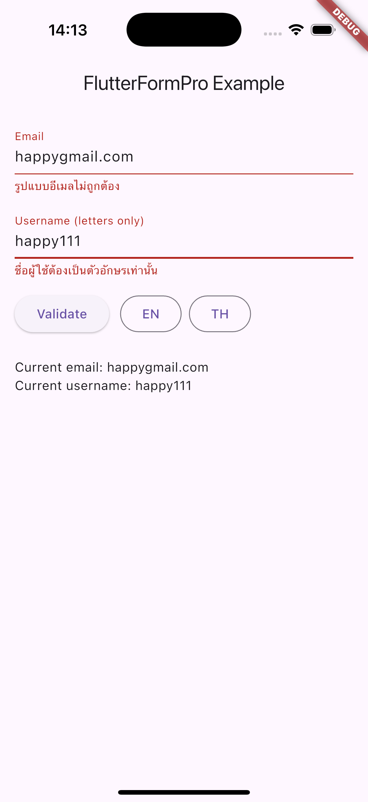

## FlutterFormPro

[](https://pub.dev/packages/flutter_form_pro)


Professional, extensible form validation and widgets for Flutter with built-in i18n (default Thai) and many ready-to-use validators.



### Features

- Rich validator set (string, number, list, date/time, network, security, Thai-specific, credit card, etc.)
- Localized error messages via JSON assets (th default; en/zh/ja/fr included)
- High performance: cached i18n maps and precompiled RegExp

### Why FlutterFormPro?

- Performance-first: reactive ChangeNotifier form core, minimal rebuilds, precompiled RegExp, and cached i18n maps.
- Thai-first i18n: ships with Thai defaults and fallbacks so error messages work even before assets are loaded.
- Flexible by design: use Validators standalone or opt into the FormPro widget set; customize via FormProField when you need full control.

### Install

Add the package to your `pubspec.yaml` and declare the i18n assets (already configured in this repo):

```yaml
dependencies:
  flutter_form_pro: ^0.0.1
```

Notes:

- When used as a dependency, the package loads JSON via `packages/flutter_form_pro/assets/i18n/...` automatically.
- Default locale is Thai (`th`). If you don’t set a locale, Thai will be used.

### Getting started

Assets are already configured under `assets/i18n/` in pubspec.

Initialize i18n early (optional, default is `th`):

```dart
import 'package:flutter_form_pro/flutter_form_pro.dart';

Future<void> main() async {
	WidgetsFlutterBinding.ensureInitialized();
	await FormProI18n.setLocaleAndLoad('en'); // or keep default 'th'
	runApp(const MyApp());
}
```

### Usage

```dart
TextFormField(
	validator: Validators.multi([
		Validators.required(),
		Validators.email(),
		Validators.minLength(6),
	]),
)
```

More examples:

```dart
Validators.isUUIDv4();
Validators.isUrl();
Validators.passwordNumberTextSpecial();
Validators.isThaiPhone();
Validators.isFutureDate();
```

### Example app

See the runnable example in `example/`.

Quick peek:

```dart
import 'package:flutter/material.dart';
import 'package:flutter_form_pro/flutter_form_pro.dart';

void main() async {
  WidgetsFlutterBinding.ensureInitialized();
  await FormProI18n.setLocaleAndLoad('th');
  runApp(const MyApp());
}

class MyApp extends StatelessWidget {
  const MyApp({super.key});
  @override
  Widget build(BuildContext context) => MaterialApp(
        title: 'FlutterFormPro Example',
        home: const DemoPage(),
      );
}

class DemoPage extends StatefulWidget {
  const DemoPage({super.key});
  @override
  State<DemoPage> createState() => _DemoPageState();
}

class _DemoPageState extends State<DemoPage> {
  final _formKey = GlobalKey<FormState>();
  String _email = '';

  @override
  Widget build(BuildContext context) {
    return Scaffold(
      appBar: AppBar(title: const Text('FlutterFormPro Example')),
      body: Padding(
        padding: const EdgeInsets.all(16),
        child: Form(
          key: _formKey,
          child: Column(
            crossAxisAlignment: CrossAxisAlignment.start,
            children: [
              TextFormField(
                decoration: const InputDecoration(labelText: 'Email'),
                onChanged: (v) => _email = v,
                validator: Validators.multi([
                  Validators.required(),
                  Validators.email(),
                  Validators.maxLength(64),
                ]),
              ),
              const SizedBox(height: 16),
              Row(
                children: [
                  ElevatedButton(
                    onPressed: () {
                      final ok = _formKey.currentState!.validate();
                      ScaffoldMessenger.of(context).showSnackBar(
                        SnackBar(content: Text(ok ? 'Valid' : 'Invalid')),
                      );
                    },
                    child: const Text('Validate'),
                  ),
                  const SizedBox(width: 12),
                  OutlinedButton(
                    onPressed: () async {
                      await FormProI18n.setLocaleAndLoad('en');
                      setState(() {});
                    },
                    child: const Text('EN'),
                  ),
                  const SizedBox(width: 8),
                  OutlinedButton(
                    onPressed: () async {
                      await FormProI18n.setLocaleAndLoad('th');
                      setState(() {});
                    },
                    child: const Text('TH'),
                  ),
                ],
              ),
              const SizedBox(height: 8),
              Text('Current email: $_email'),
            ],
          ),
        ),
      ),
    );
  }
}
```

### Locale switching

```dart
await FormProI18n.setLocaleAndLoad('th');
// or preload for fast switching
await FormProI18n.preload(['th','en','ja']);
```

### Core concepts

- Validator: `typedef Validator = String? Function(dynamic value)`
  - Return `null` when valid; return a localized message when invalid.
- `Validators` class: static factory methods for common checks.
- Compose multiple validators with `Validators.multi([...])` (returns the first error).

### Common validator recipes

- Text
  - `Validators.required()`
  - `Validators.minLength(6)`, `Validators.maxLength(32)`
  - `Validators.isAlpha()`, `Validators.isAlphanumeric()`, `Validators.isAscii()`
  - `Validators.onlyThaiText()`, `Validators.onlyEnglishText()`
  - `Validators.isLowerCase()`, `Validators.isUpperCase()`
  - Password policy: `passwordNumber`, `passwordNumberText`, `passwordNumberOrText`, `passwordNumberTextSpecial`, `passwordStrong`, `passwordWeak`
- Number
  - `Validators.isInt()`, `Validators.isDouble()`
  - `Validators.isPositive()`, `Validators.isNegative()`
  - `Validators.isEven()`, `Validators.isOdd()`
  - `Validators.isMultipleOf(n)`
- List / Enum
  - `Validators.isInList(['a','b'])`, `Validators.isNotInList([...])`
  - `Validators.isEnumValue(MyEnum.values)` (or any list of values)
- Date / Time (format: `YYYY-MM-DD`, e.g., `2025-01-31`)
  - `Validators.date()`, `Validators.datetime()` (YYYY-MM-DD HH:mm:ss)
  - `Validators.isFutureDate()`, `Validators.isPastDate()`
- Network / Format
  - `Validators.email()`, `Validators.isEmailDomain('example.com')`
  - `Validators.isUrl()`, `Validators.isJson()`, `Validators.isHexColor()`
- Identity / Security
  - `Validators.username()`, `Validators.phone()`
  - `Validators.otp()`, `Validators.pin()`
  - `Validators.creditCard()`, `Validators.isVisaCard()`, `Validators.isMasterCard()`
- Thai-specific
  - `Validators.isThaiPhone()`, `Validators.isThaiZipCode()`
  - `Validators.nationalId()`
- Misc
  - `Validators.uuid` (v4), `Validators.isIPv4()`, `Validators.isIPv6()`
  - `Validators.isCurrency()`, `Validators.isBaht()`, `Validators.isDollar()`
  - `Validators.isFileExtension(['.png','.jpg'])`
  - `Validators.noWhitespace()`, `Validators.noRepeatChar()`, `Validators.noSequentialChar()`
  - `Validators.isPalindrome()`, `Validators.isPrime()`

### Custom validators

- Quick predicate:

```dart
TextFormField(
	validator: Validators.custom((v) => (v is String) && v.startsWith('F')), // null when true
)
```

- Invert a pattern (`notMatch`):

```dart
final noDigits = Validators.notMatch(RegExp(r"\d"), 'Digits are not allowed');
```

- Compose:

```dart
final v = Validators.multi([
	Validators.required(),
	Validators.email(),
	Validators.maxLength(64),
]);
```

### Localization (i18n)

- Default locale: `th`
- Switch locale at runtime:

```dart
await FormProI18n.setLocaleAndLoad('en');
// Optional: FormProI18n.preload(['th','en','ja']);
```

- Override a message at runtime:

```dart
FormProI18n.add('required', 'This field cannot be empty');
```

- Add your locale: create `assets/i18n/<code>.json`, then

```dart
await FormProI18n.setLocaleAndLoad('<code>');
```

The package falls back to Thai if the desired locale can’t be loaded. Core keys have built‑in Thai fallbacks to avoid empty strings even before assets load.

### Performance tips

- i18n maps are cached per locale; use `preload([...])` if switching often.
- `Validators` use precompiled RegExp—reuse validators when possible.
- Short‑circuit empty values (e.g., skip heavy checks when `required` already fails).

### Troubleshooting

- “Missing i18n”: ensure `assets/i18n/` exists and paths are declared under `flutter: assets:` in `pubspec.yaml`.
- When using this package as a dependency, asset loads use `packages/flutter_form_pro/...` automatically (no extra config needed).
- Still seeing English/keys? Call `await FormProI18n.ensureLoaded()` or set a locale during app init.

### Testing

Run unit tests:

```zsh
flutter test
```

The test suite includes edge cases for date/time boundaries and list/enum negatives.

### Form widgets (reactive)

Build a reactive form with FormPro (ChangeNotifier-based) and use ready-to-go widgets.

```dart
import 'package:flutter_form_pro/flutter_form_pro.dart';

late final FormPro form;

@override
void initState() {
  super.initState();
  form = FormPro.builder()
      .addField('email', FormFieldConfig(validators: [Validators.required(), Validators.email()]))
      .addField('username', FormFieldConfig(validators: [Validators.required()]))
      .addField('city', FormFieldConfig(validators: [Validators.required()]))
      .build();
}

@override
Widget build(BuildContext context) {
  return FormProWidget(
    form: form,
    onSubmit: (values) => debugPrint('submit: $values'),
    child: const FormProKeyboardSubmit(
      // Press Enter/NumpadEnter to submit
      child: Column(
        crossAxisAlignment: CrossAxisAlignment.start,
        children: [
          SizedBox(height: 12),
          FormProTextField(
            formFieldName: 'email',
            decoration: InputDecoration(labelText: 'Email'),
          ),
          SizedBox(height: 12),
          // Controller-friendly version for advanced cursor control
          FormProTextControllerField(
            formFieldName: 'username',
            decoration: InputDecoration(labelText: 'Username'),
          ),
        ],
      ),
    ),
  );
}
```

Autocomplete and keyboard submit in one:

```dart
FormProAutocomplete<String>(
  formFieldName: 'city',
  optionsBuilder: (text) {
    const cities = <String>{'Bangkok', 'Chiang Mai', 'Phuket', 'Khon Kaen'};
    final q = text.text.toLowerCase();
    return cities.where((c) => c.toLowerCase().contains(q));
  },
  displayStringForOption: (s) => s,
  decoration: const InputDecoration(labelText: 'City'),
),
const SizedBox(height: 16),
const FormProSubmitButton(child: Text('Submit')),
```

Cupertino-style field:

```dart
const FormProCupertinoTextField(
  formFieldName: 'email',
  placeholder: 'Email',
)
```

Fully custom UI with builder (use your own controllers if needed):

```dart
final myController = TextEditingController();
...
FormProField<String>(
  name: 'username',
  builder: (ctx, value, error, onChanged) => TextField(
    controller: myController..text = value ?? '',
    decoration: InputDecoration(labelText: 'Custom Username', errorText: error),
    onChanged: onChanged,
  ),
)
```

Additional widgets:

```dart
// Numbers only (with optional sign/decimal)
const FormProNumberField(
  formFieldName: 'amount',
  decoration: InputDecoration(labelText: 'Amount'),
  allowDecimal: true,
  signed: false,
)

// Date picker (stores `YYYY-MM-DD`)
const FormProDatePickerField(
  formFieldName: 'birthday',
  decoration: InputDecoration(labelText: 'Birthday'),
)
```
